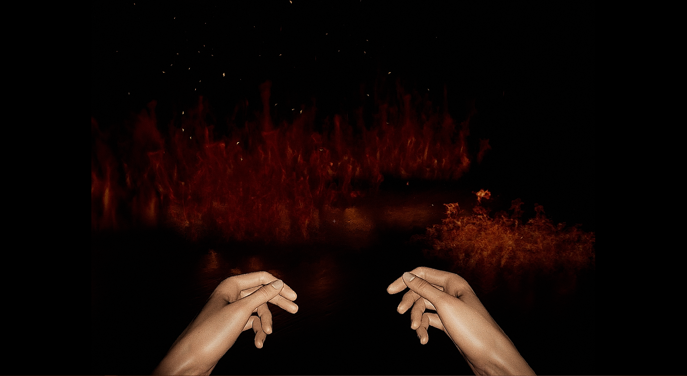
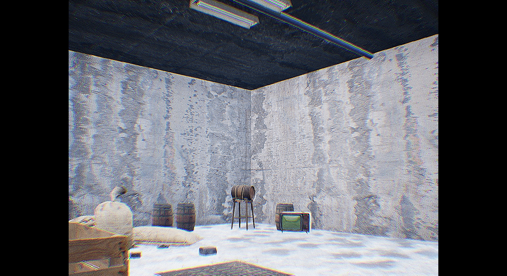
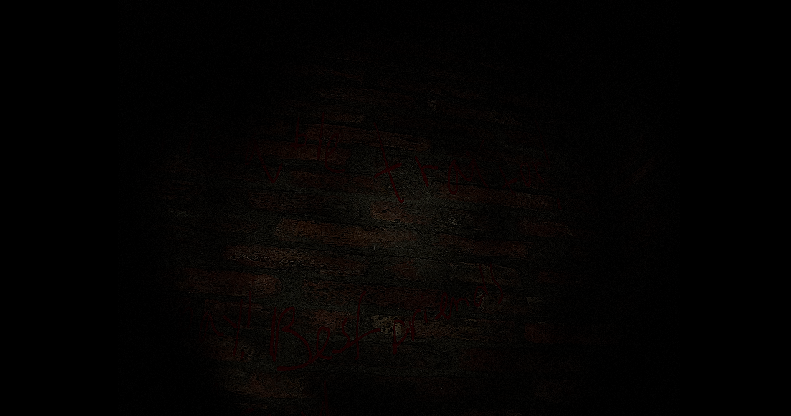

## Shadow Entertainment Games

### Projects:
*Traitor's Judgement*, **Delay: 3 Weeks after planned release date** - Horror, Survival, Action, VHS

*Welcome to programming*, **Delayed developing: 2024** - Vintage, Programming, 2D, Pixel

### Group
Denislav Nikolov - Story, Additional Game Design, QS, Tester  
Bozhidar Genchev - Developer, Story, UI creator, Game Design
Kaloian Anglelov - Additional Story, Alpha Logos, Additional Game Design  
Gencho Genchev - Artist

### Who is Bozhidar Genchev - the dev?
So firstly I'm the creator of this website...
I made the Shadow Group and united my friends to work on a project together!
Also, I use UE5 to make our games. So I'm a person that always had big dreams icluding my fav thing - computers! 

### Graphics
> VHS - Vintage styled horror games with old VHS player graphics.
>> Shooter - Super realistic games with very good shadows and lightning.
>>> Photorealism - Shockingly realistic games designed for VR.
>>>> 2D - Basic 2D games.

### Inspiration & Info
Traitor's Judgement is a VHS style physic horror game. Inspired by:
[Poppy Playtime](https://store.steampowered.com/app/1721470/Poppy_Playtime/ "Poppy Playtime"

[Choo-Choo Charles](https://store.steampowered.com/app/1766740/ChooChoo_Charles/ "Choo-Choo Charles")

The game will release on Steam, Epic Games, GameJolt, Itch io in 1/2 year(s). 

*Overall game prices:*

Base game - 4,99

Chapter 1 - Free DLC

Chapter 1/ Part 2 - 2,99

Chapter 2 - 7,99

The final ending - 10,00

| Price | Base | CH1  | CH1/2 | CH2  | End 
| :---: | :--: | :-:  | :---: | :---:| :---: 
|   >   | 4,99 | Free | 2,99  | 7,99 | 10,00 

__the game will be released in Early Access. Why?__
We want to make the best we can for this game, so when we release it in the next 1/2 years we will keep __adding content!__

With this philosophy every bug that occurs will be able to be repaired. Also there will be a lot of Minor and Major updates.

### Story Sneak Peek
In this horror game you play as Mike – a farmer. One day he was transfering heavy bags of wheat. While he was walking trough the field he saw a homeless man limping around. When the man saw Mike he begged him for food. He replied he will give him food only if he carried his bags with wheat. The man said he will try his best, and on his first steps he dropped the bag and it fell on him. The man haven't eaten in days, so the bag's weight was more than his and he passed away. Mike just continued with his job and got to sleep.
    At around 2:00 PM he woke up and his whole home and farm was burning. He started to scream and tried to get out. He broke a window and jumped out of it. He was running and running. Everything around him was burning. 

*The game is work in progress - many things will change, including the story!*

Early Stages of Developement. **Images represent a game still in developement**

### System Requirements
Minimum:

OS: Windows 10, STORAGE: 2/3 KB, RES: Full HD

Recommended:

OS: Windows 11, STORAGE: 2/3 KB, RES: 4K

### Links
[Discord Group](https://discord.com/channels/1175447160918130778/1175447160918130781 "Discord")

[Traitor's Jdugement Intro](https://www.youtube.com/watch?v=g9_0vlAfNgo "Intro")

[Traitor's Jdugement secret reportage](https://github.com/ShadowEntertainment/TJ-Secret-Reportage "Secret 001")

[Follow Gencho Genchev](https://www.instagram.com/g.genchev_art/?hl=bg "Follow him (;")

**We know that this site is very long. If you have a lower PC check out this repository: https://github.com/ShadowEntertainment/shadowentertainment-lowpc.github.io/tree/main**

#### Shadow EntertainmentⒸ, 2023, GitHubⒸ
#### All images are property of Shadow Entertainment. Do not copy!

##### Support us: Please sub to the game dev's channel: (https://www.youtube.com/channel/UC1xg4YTbwNh3fnyHKwluUwA) and like our videos (;
